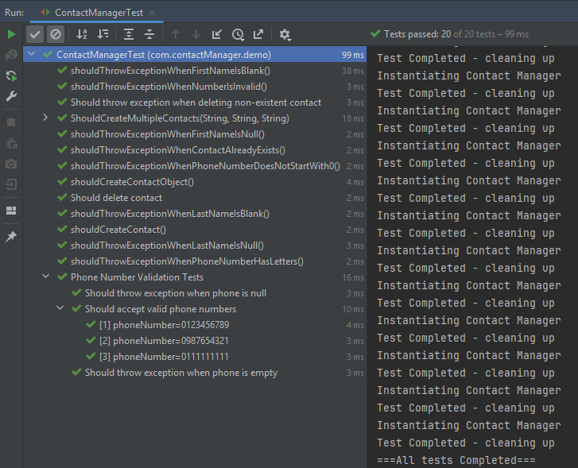

# Contact Manager - JUnit 5 Testing Project


## Project Overview

This project implements a simple contact management system with robust validation and comprehensive test coverage. The focus is on demonstrating JUnit 5 features and best practices rather than building a production application.

## Test Results



**Total Tests**: 20  
**Success Rate**: 100%  
**Execution Time**: ~99ms

All tests pass successfully, demonstrating comprehensive coverage of functionality, edge cases, and error handling.

## Features

- **Contact Management**: Create, store, and delete contacts with validation
- **Input Validation**: Comprehensive validation for names and phone numbers
- **Duplicate Prevention**: Automatic detection and prevention of duplicate entries
- **Thread-Safe Operations**: Uses ConcurrentHashMap for concurrent access
- **Complete Test Coverage**: 20+ unit tests covering all functionality

## Technologies

- **Java 22**
- **JUnit 5.12.2** - Testing framework
- **Maven** - Build and dependency management

## Project Structure

```
src/
├── main/java/com/contactManager/demo/
│   ├── Contact.java              # Contact entity with validation
│   └── ContactManager.java       # Contact management logic
└── test/java/com/contactManager/demo/
    └── ContactManagerTest.java   # Comprehensive test suite
```

## Validation Rules

### Phone Numbers
- Must be exactly 10 digits
- Must contain only numeric characters
- Must start with '0'
- Cannot be null or empty

### Names (First & Last)
- Cannot be null or empty
- Cannot be blank (whitespace only)

## JUnit 5 Features Demonstrated

### Basic Testing
- `@Test` - Standard test methods
- `assertEquals()`, `assertFalse()`, `assertThrows()` - Assertions
- Exception testing with lambdas

### Test Lifecycle
- `@BeforeAll` - One-time setup before all tests
- `@AfterAll` - One-time cleanup after all tests
- `@BeforeEach` - Setup before each test
- `@AfterEach` - Cleanup after each test

### Parameterized Tests
- `@ParameterizedTest` - Run tests with multiple inputs
- `@ValueSource` - Simple parameter source
- `@CsvSource` - Multiple parameter values
- `@MethodSource` - Complex parameter generation

### Test Organization
- `@Nested` - Grouping related tests
- `@DisplayName` - Readable test descriptions
- `@Disabled` - Temporarily skip tests
- `@RepeatedTest` - Run tests multiple times

## Running the Tests

```bash
# Run all tests
mvn test

# Run specific test class
mvn test -Dtest=ContactManagerTest

# Run with coverage
mvn clean test jacoco:report
```

## Key Learnings

1. **Test-Driven Development (TDD)**: Writing tests before implementation
2. **Exception Testing**: Validating error handling with `assertThrows()`
3. **Parameterized Testing**: Reducing code duplication with data-driven tests
4. **Test Organization**: Using `@Nested` classes for logical grouping
5. **Test Lifecycle Management**: Proper setup and teardown with lifecycle hooks
6. **Edge Case Testing**: Testing null, empty, and invalid inputs

## Code Examples

### Creating a Contact with Validation
```java
ContactManager manager = new ContactManager();
manager.addContact("John", "Doe", "0123456789");
```

### Testing Exception Handling
```java
@Test
public void shouldThrowExceptionWhenPhoneNumberIsInvalid() {
    Contact contact = new Contact("John", "Doe", "12345");
    assertThrows(RuntimeException.class, () -> {
        contact.validatePhoneNumber();
    });
}
```

### Parameterized Testing Example
```java
@ParameterizedTest
@ValueSource(strings = {"0123456789", "0987654321", "0111111111"})
public void shouldAcceptValidPhoneNumbers(String phoneNumber) {
    contactManager.addContact("John", "Doe", phoneNumber);
    assertFalse(contactManager.getAllContacts().isEmpty());
}
```

## Future Enhancements

- [ ] Implement contact update functionality
- [ ] Add search and filter capabilities
- [ ] Implement email validation
- [ ] Add integration tests
- [ ] Implement database persistence
- [ ] Add REST API endpoints

## Why This Project?

This project was built as preparation for contributing to open-source projects, specifically targeting Google Summer of Code 2026. The comprehensive test suite demonstrates:

- Understanding of software testing principles
- Ability to write maintainable test code
- Knowledge of JUnit 5 features used in real-world projects
- Test-driven development workflow
- Clean code practices

## Contributing

This is a learning project, but suggestions and improvements are welcome. Feel free to:

1. Fork the repository
2. Create a feature branch
3. Add tests for new functionality
4. Submit a pull request

## Author

Built with dedication to learning JUnit 5 and test-driven development practices.

## License

This project is open source and available for educational purposes.

## Acknowledgments

- JUnit 5 documentation and community
- Test-driven development best practices
- Open-source contribution guidelines

---

**Note**: This project prioritizes learning and demonstrating testing concepts over production-ready features. The goal is to understand JUnit 5 thoroughly for contributing to larger open-source projects.
